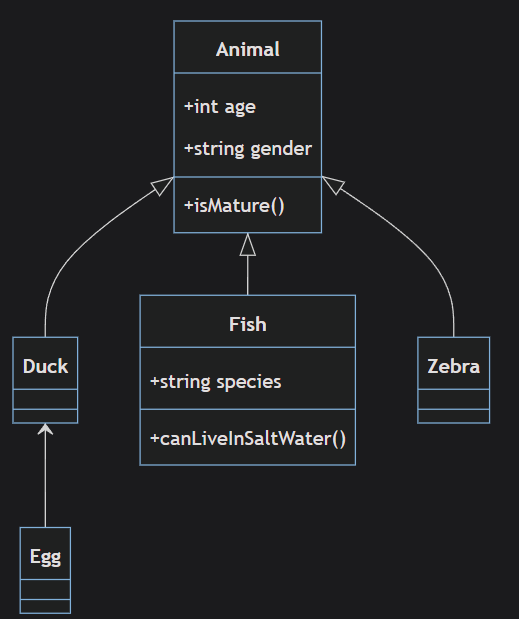

# Introduction with basics of Design Patterns and Solid Principles

## Unified Modeling Language (UML)

- _UML_, or _Unified Modeling Language_, is a standard language used in software engineering for visualizing the design of a system.
- The goal of UML is to provide a universal way to visualize the way a system has been designed.
- [Read more about UML](https://cloudaffle.com/series/typescript-design-patterns/introduction-to-uml/)

### How to Read the UML Diagram

#### Key Elements in the UML Diagram:

1. **Classes**:

   - The diagram contains multiple classes, each represented by a rectangle divided into three sections:
     - **Top Section**: The name of the class.
     - **Middle Section**: The properties (attributes) of the class.
     - **Bottom Section**: The methods (functions) of the class.

2. **Access Modifiers**:

   - Symbols before properties and methods indicate their visibility:
     - `+` denotes **public** (accessible from anywhere).
     - `-` denotes **private** (accessible only within the class).
     - `#` denotes **protected** (accessible within the class and its subclasses).

3. **Inheritance**:

   - A solid line with a hollow triangle pointing to the parent class indicates inheritance.
   - For example, if `Duck` inherits from `Animal`, the line will point from `Duck` to `Animal`.

4. **Relationships**:

   - **Association**: A solid line between two classes indicates a relationship.
   - **Aggregation**: A line with a hollow diamond indicates that one class is part of another but can exist independently.
   - **Composition**: A line with a filled diamond indicates a stronger relationship where one class cannot exist without the other.

5. **Abstract Classes and Interfaces**:
   - Abstract classes or interfaces are usually italicized or have a specific notation (e.g., `<abstract>` or `<interface>` respectively).

- **Relationships**:
  - The inheritance relationship is shown with lines and hollow triangles pointing to the parent class.

By understanding these elements, you can interpret the structure and relationships in the UML diagram effectively.

### Ex. 1.: Reading a basic UML diagram

#### In this UML diagram:

- There are five classes `Animal`, `Duck`, `Egg`, `Fish` and `Zebra`. (This can be an abstract class or, interface if it is mentioned explicitly).
- The `Animal` class has **two properties** `age` and `gender` and **one method** `isMature`.
- The sign before the **properties** and **methods**:
  - `+` denotes public,
  - `-` denotes private, and
  - `#` denotes protected properties or methods.
- The `Duck` and `Zebra` classes inherit from the `Animal` class without adding any additional properties or methods. They rely entirely on the functionality provided by the `Animal` class.
- The `Egg` class inherit from the `Duck` class without adding any additional properties or methods.
