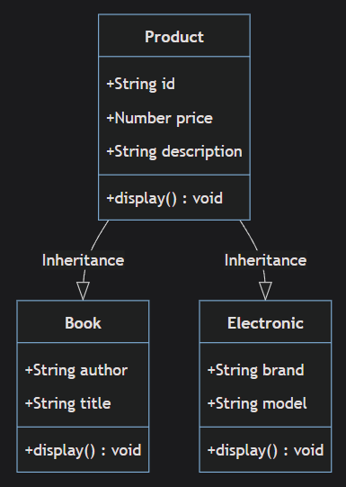

# OOPS with TypeScript

## Resources

- [OOPS Introduction](https://cloudaffle.com/series/object-oriented-typescript/introduction-to-oop/)
- [OOPS Lingo](https://cloudaffle.com/series/object-oriented-typescript/the-oop-lingo/)
- Abstraction
  - [Abstraction Intro & Implementation](https://cloudaffle.com/series/object-oriented-typescript/abstraction-in-typescript/)
  - [Abstraction Real World Example](https://cloudaffle.com/series/object-oriented-typescript/abstraction-example/)
  - [TypeORM](https://typeorm.io/)
- Encapsulation
  - [Encapsulation Intro & Implementation](https://cloudaffle.com/series/object-oriented-typescript/encapsulation-in-typescript/)
  - [Encapsulation Real World Example](https://cloudaffle.com/series/object-oriented-typescript/encapsulation-example-with-nestjs/)
- Inheritance
  - [Inheritance Intro & Implementation](https://cloudaffle.com/series/object-oriented-typescript/inheritance-in-typescript/)
  - [Inheritance Real World Example](https://cloudaffle.com/series/object-oriented-typescript/why-use-inheritance/)
- Polymorphism
  - [Polymorphism Intro & Implementation](https://cloudaffle.com/series/object-oriented-typescript/polymorphism-in-typescript/)
  - [Polymorphism Real World Example](https://cloudaffle.com/series/object-oriented-typescript/polymorphism-by-example/)

## Proper Handling of Access Modifiers in TypeScript Inheritance

When extending a parent class in TypeScript, it is important to understand how access modifiers (`public`, `private`, `protected`) affect properties passed to the parent class constructor. This ensures that properties are not unnecessarily re-declared in the child class, avoiding redundancy and potential bugs.

### Scenario



In the following example, the `Book` class extends the `Product` class. The `Product` class has properties `id`, `price`, and `description`, which are initialized in its constructor. The `Book` class adds additional properties `author` and `title`. (Ignore the `Electronics` for this example).

### Code Example

```typescript
class Product {
  constructor(
    public id: string,
    public price: number,
    public description: string,
  ) {}

  display(): void {
    console.log(
      `\nID: ${this.id}, \nPrice: ${this.price}, \nDescription: ${this.description}.`,
    );
  }
}

// Incorrect Implementation
class Book extends Product {
  constructor(
    public id: string,
    public price: number,
    public description: string,
    public author: string,
    public title: string,
  ) {
    super(id, price, description);
  }

  display(): void {
    super.display();
    console.log(`Author: ${this.author}, \nTitle: ${this.title}`);
  }
}
```

### Why Avoid public for `id`, `price`, and `description` in `Book`

#### Key Points:

1. **Properties Already Declared in Parent Class**:
   - The `id`, `price`, and `description` properties are already declared in the `Product` class and initialized via its constructor.
   - Adding `public` in the `Book` class constructor would create new properties in the `Book` class, shadowing the inherited properties from `Product`.
2. **Redundancy**:
   - Declaring these properties again in the `Book` class is redundant and can lead to confusion.
3. **Shadowing Issue**:
   - If `public` is used in the `Book` class, the `id`, `price`, and `description` properties in `Book` will shadow the properties in `Product`. This can cause unexpected behavior.

#### Correct Implementation:

Remove the `public` modifier for `id`, `price`, and `description` in the `Book` class constructor:

```typescript
class Book extends Product {
  constructor(
    id: string, // No `public` modifier
    price: number, // No `public` modifier
    description: string, // No `public` modifier
    public author: string,
    public title: string,
  ) {
    super(id, price, description);
  }

  display(): void {
    super.display();
    console.log(`Author: ${this.author}, \nTitle: ${this.title}`);
  }
}
```

### What Happens If public Is Used?

If `public` is used for `id`, `price`, and `description` in the `Book` class, TypeScript will create new properties in the `Book` class, shadowing the inherited properties from `Product`.

```typescript
class Book extends Product {
  constructor(
    public id: string, // Creates a new  property in Book
    public price: number, // Creates a new  property in Book
    public description: string, // Creates a new  property in Book
    public author: string,
    public title: string,
  ) {
    super(id, price, description); // Initializes the parent class properties
  }
}
```

#### In this case:

- The `id`, `price`, and `description` properties in `Book` are different from those in `Product`, even though they have the same names.
- This can lead to confusion and bugs, as the parent class properties and child class properties are not the same.

### Conclusion

- **Do not use `public` for `id`, `price`, and `description` in the `Book` class constructor**.
- Let the parent class `Product` handle these properties. Only use `public` (or other access modifiers) for properties that are unique to the `Book` class, such as `author` and `title`.

By following this approach, you ensure clean and maintainable code while avoiding redundancy and potential shadowing issues
